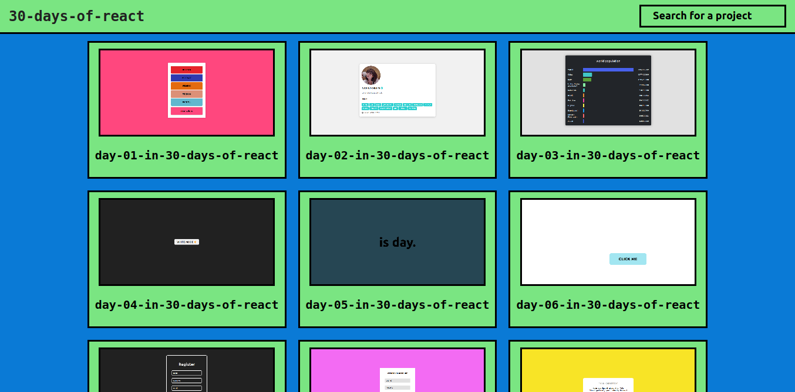

# day-30-in-30-days-of-react 

- in this project i did something to represent my path in these 30 days, i created a website to show all the projects and apply knowledge that i obtained in those 30 days

[VIew result in this site](https://30daysofreact.netlify.app/)

# result image  

